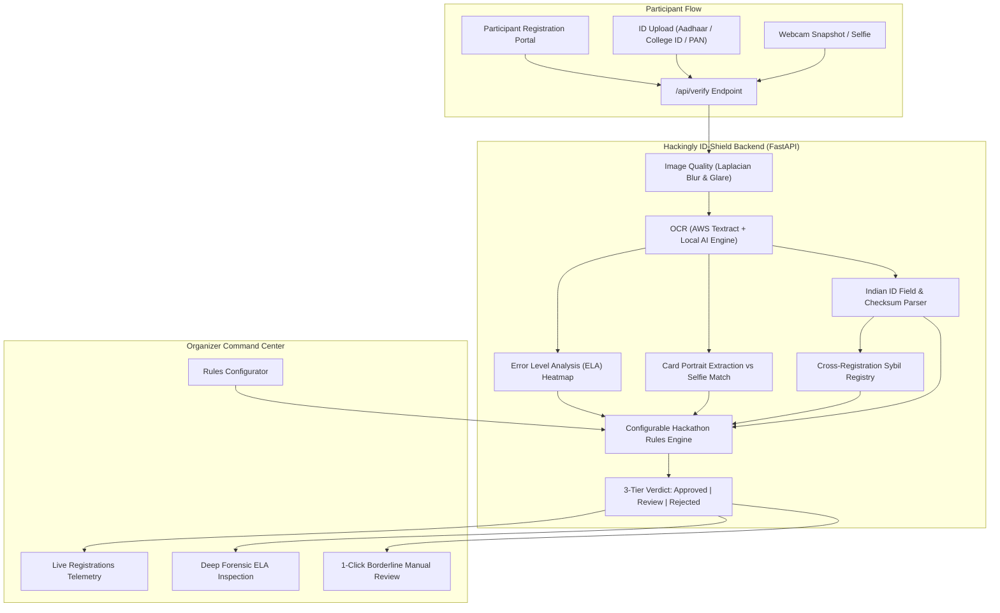

# Hackingly ID-Shield 🛡️
### AI-Powered Identity & Eligibility Verification for Hackathon Registrations
**AI Build Challenge Bengaluru 2026 • Problem Statement PS-003 (Hackingly Platform Track)**  
*Industry Partner: Hackingly*

---

## 🚀 Executive Summary
Hackingly powers registrations for hackathons, collegiate challenges, and innovation competitions across India and globally. Many of these competitions require age restriction gating (e.g. 18–25 years), student-only enrollment verification (accredited Indian university or college), and reliable proof of identity (Aadhaar, College ID, PAN Card). 

Previously, Hackingly relied on a simple OCR pipeline that only extracted Date of Birth (DOB) from an image. This created significant operational vulnerabilities:
1. **No Forgery / Tampering Detection**: Inability to catch Photoshopped or digitally edited DOBs/names.
2. **Sybil & Duplicate Account Fraud**: Inability to detect the same ID being reused across multiple registrations under different names.
3. **Impersonation**: Inability to verify if the applicant is the person pictured on the document.
4. **False Positive Friction**: Legitimate participants being blocked by rigid, brittle OCR regexes.

**Hackingly ID-Shield** extends the existing OCR pipeline into a full-scale, production-ready AI identity and eligibility verification platform.

---

## ✨ Key Capabilities

### 1. Drop-In AWS Textract Adapter + Local AI Fallback
- Direct drop-in compatibility with Hackingly's current endpoint `/api/textract/dob`.
- **Dual Engine Architecture**: Automatically connects to live AWS Textract when AWS credentials are provided, or seamlessly transitions to a built-in Local AI OCR engine (`EasyOCR` / `PyTesseract`) for 100% offline, local, or air-gapped demoing with zero cloud costs or runtime failures.

### 2. Specialized Indian Document Intelligence & Checksums
- Native extraction of Name, DOB, Age, Gender, ID Number, and Institution.
- **Aadhaar Verhoeff Checksum**: Full implementation of the UIDAI Dihedral Group $D_5$ algorithm to mathematically validate 12-digit Aadhaar numbers and identify bogus/corrupted IDs.
- **PAN Card Structural Validator**: Validates 10-character alphanumeric PAN format, verifies individual status code (`P`), and checks surname initial consistency.
- **College / Student ID Parsing**: Identifies Indian institutions (IITs, NITs, BITS, universities) and student roll patterns.

### 3. Digital Forensics & Tampering Detection (ELA)
- **Error Level Analysis (ELA)**: Resaves documents at calibrated JPEG quality levels and computes pixel error disparity to expose digital photo manipulation, cloned text, and Photoshopped DOBs.
- **Visual ELA Heatmap**: Generates high-contrast false-color heatmaps (Jet colormap) highlighting manipulated pixels in bright yellow and red for organizer inspection.
- **Image Quality Scoring**: Laplacian blur variance and glare reflection analysis to differentiate between an unreadable blurry photo vs intentional forgery.

### 4. Cross-Registration Duplicate & Sybil Attack Graph
- Tracks and hashes ID numbers and face signatures in a cross-registration database.
- Immediately flags multi-accounting, duplicate submissions, and Sybil attacks where an existing participant's ID is submitted under a different name.

### 5. Biometric Face Cross-Verification
- OpenCV facial detection and cropping from ID card portraits.
- Live webcam selfie capture or photo upload directly in the registration flow.
- Normalized cross-correlation, HSV histogram comparison, and facial similarity scoring (0–100%).

### 6. Three-Tier Decision Engine (Minimizing False Positives)
- **`APPROVED`**: All criteria satisfied with high confidence (auto-admitted to the hackathon).
- **`MANUAL_REVIEW`**: Borderline cases (slight camera blur or glare, minor text skew). Instead of rejecting and blocking a legitimate student, routes to an organizer 1-click triage queue!
- **`REJECTED`**: Definite eligibility or integrity violation (underage < 18, high tampering risk, or Sybil ID reuse).
- Clear, human-readable reason bullet points for every decision.

---

## 📐 System Architecture



---

## 🧪 Pre-Configured Test Presets (Built-in Demo Suite)
Select any scenario from the top navbar dropdown for instant evaluation:
1. **Eligible Student (Pass)**: 21yo IIT Bombay student with valid Aadhaar + College ID + matching selfie.
2. **Underage Candidate (Fail)**: 15yo applicant (DOB: 2011). Fails minimum age eligibility constraint (18–25).
3. **Photoshopped / Tampered DOB (Fraud)**: Digitally altered DOB patch. Triggers Error Level Analysis (ELA) tampering alert.
4. **Reused ID / Sybil Attack (Fraud)**: Candidate attempting to register with an Aadhaar card already used by another applicant.
5. **Blurry ID Document (Review Queue)**: Camera motion blur. Routed to 1-click manual review rather than hard false rejection.
6. **Face Mismatch**: Uploaded ID portrait does not match the live webcam selfie of the registrant.

---

## 🛠️ Quickstart & Local Setup

### 1. Backend (Python 3.10+)
```bash
# 1. Install dependencies
pip install -r backend/requirements.txt

# 2. Run backend tests
python -m unittest discover -s backend/tests

# 3. Start the FastAPI server
uvicorn backend.main:app --host 0.0.0.0 --port 8000 --reload
```
API Documentation will be live at `http://localhost:8000/docs`.

### 2. Frontend (Node.js 18+)
```bash
# 1. Navigate to frontend directory
cd frontend

# 2. Install dependencies
npm install

# 3. Start Vite dev server
npm run dev
```
Open `http://localhost:5173` in your browser.

---

## 👥 Hackathon Evaluation Checklist (100% Weightage)
- ✅ **Problem Understanding & Relevance**: Addresses Aadhaar, College ID, PAN, DOB age limits, and Sybil attack prevention.
- ✅ **Solution Quality & Problem-Solution Fit**: Complete pipeline from upload to 3-tier decision.
- ✅ **Execution & Working Prototype**: Full-stack running app with live camera capture and real-time backend verification.
- ✅ **Innovation / Use of AI**: Error Level Analysis (ELA) heatmaps, Verhoeff checksums, and biometric cross-verification.
- ✅ **Feasibility & Potential Impact**: Drop-in compatible with Hackingly's current Textract DOB flow.
